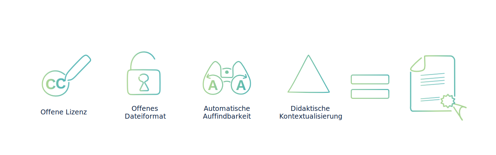
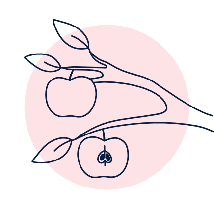

## Merkmale von OER

<figure>
  
  <figcaption style="text-align:center;font-size:14px;">Abb. <i>Merkmale von OER</i></figcaption>
</figure>

Es gibt bei der Erstellung und Veröffentlichung von freien Bildungsmaterialien einige Aspekte zu beachten. Diese Aspekte stehen eng mit den vier grundlegenden Merkmale von OER in Verbindung. Die Beachtung dieser Merkmale können zu hochwertigen Bildungsmaterialien führen und gewährleisten einen OER-Standard.
Im Folgenden werden diese Merkmale erläutert.

## 1. OER sind offen lizenziert

<figure>
  
  <figcaption style="text-align:center;font-size:14px;">Abb. <i>Offene Lizenz</i></figcaption>
</figure>

OER sind freie Bildungsmaterialien, die mit einer <b>offenen Lizenz</b> versehen sind, die Dritten explizit <b>Nutzungsrechte</b> einräumt. Erst durch diese offene Lizenzierung wird das Material weiterverwendbar. Die offene Lizenzierung stellt folglich das zentrale Merkmal dar, das OER kennzeichnet. Gerade das Lizenzsystem Creative Commons bietet im Bildungskontext viele Vorteile, da die Urheber:innen durch entsprechende Lizenzbausteine differenziert entscheiden können, welche Rechte sie Dritten an ihrem Bildungsmaterial einräumen möchten. 

<figure>
  
  <figcaption style="text-align:center;font-size:14px;">Abb. <i>CC-Lizenzmodule</i></figcaption>
</figure>

Die Nutzung von OER erfolgt also nicht im „rechtsfreien Raum“ (s. Kapitel <a aria-label="Link zur Seite: Urheberrechte und Lizenzen." href="#/urheberechte_und_lizenzen.md">Urheberrecht und offene Lizenzen</a>). Sie basiert auf rechtsgültigen Verträgen, die allerdings den Vorteil haben, dass sie nicht im Rahmen einer individuellen Transaktion (Vertragsverhandlung, Vertragsschluss), sondern „automatisch“ zustande kommen. Wird gegen die OER-Nutzungsvereinbarung verstoßen, sind die üblichen rechtlichen Möglichkeiten eröffnet, dagegen vorzugehen.

## 2. OER liegen in einem möglichst offenen Dateiformat vor 

<figure>
  
  <figcaption style="text-align:center;font-size:14px;">Abb. <i>Offenes Dateiformat</i></figcaption>
</figure>

Ein weiteres zentrales Merkmal von OER ist die Verwendung von offenen Dateiformaten. Diese ermöglichen (unter Berücksichtigung des Lizenztextes) die Nachnutzung und Bearbeitung der Materialien. Daher ist der Rückgriff auf weitverbreitete Werkzeuge und Open Source Anwendungen bei der Erstellung sowie die Speicherung der Materialien in möglichst offenen Dateiformaten von Vorteil.

### Kriterien für offene Dateiformate sind

<figure>
  
  <figcaption style="text-align:center;font-size:14px;">Abb. <i>OER Gardening</i> von Merle Zander und twillo, lizenziert unter <a aria-label="Link zur Quelle (CreativeCommons Seite)" href="https://creativecommons.org/licenses/by/4.0/deed.de" target="_blank">CC BY (4.0)</a></figcaption>
</figure>

<b>Offene Standards</b> einfache Weiterverarbeitung durch Open Source Software
 
 
<b>Editierbarkeit</b> Möglichkeit zur Anpassung der Materialien
 
 
<b>Versionierbarkeit</b> Dokumentation von Änderungen und der Möglichkeit zur Wiederherstellung von Vorgängerversionen

 
 
Beispielsweise kann dies bedeuten, dass bei Textdokumenten das Format DOCX dem Format PDF vorzuziehen ist (Editierbarkeit), während das Format odt Vorteile gegenüber dem Format doc besitzt (Offener Standard). Möglich ist es auch Bildungsmaterialien in mehreren Dateiformaten bereitzustellen. Dies bietet sich auch an, wenn Kopatibilitätsprobleme zu befürchten sind. So etwa kann ein Arbeitsblatt im odt Format bereitgestellt werden und die Editierbarkeit zugewährleisten und zusätzlich im PDF Format, um das Layout auch in verschiedenen Systemen oder Anwendungen zu erhalten.

## 3. OER sind umfassend beschrieben und automatisch auffindbar

<figure>
  
  <figcaption style="text-align:center;font-size:14px;">Abb. <i>Automatische Auffindbarkeit</i></figcaption>
</figure>

Freie Bildungsmaterialien sollten möglichst einfach und mit wenig Rechercheaufwand gefunden werden und deshalb möglichst gut beschrieben sein. Hierfür sind prägnante Titel, Beschreibungen und Schlagworte, die Lizenzauszeichnung sowie die Name(n) der Autor:innen relevante Angaben. Diese Informationen werden auch Metadaten genannt und sorgen für die Möglichkeit der standardisierten, maschinellen Suche.

Twillo unterstützt bei der Angabe der Metadaten und begleitet die Veröffentlichung durch eine geführte Metadatenabfrage.

## 4. OER sind didaktisch strukturiert und kontextualisiert

<figure>

  <figcaption style="text-align:center;font-size:14px;">Abb. <i>Didaktische Kontextualisierung</i></figcaption>
</figure>

Materialien, die für den Bildungskontext erstellt werden, sind für spezifische Zielgruppen und Lehrkontexte konzipiert. Diese Informationen sind häufig nur implizit in den Bildungsmaterialien enthalten, sind aber wichtig für eine erste Einschätzung des Materials von Seiten der Lehrenden, die sie nachnutzen möchten. Das Explizieren von Kontextinformationen für den Lehreinsatz erleichtert die Einschätzung der Passung der Bildungsmaterialien für den jeweiligen Lehrkontext. Damit erhalten Hochschullehrende einen Überblick über den didaktischen Gerhalt der Bildungsmaterialien und können davon ausgehend die Verwendung in den eigenen Lehrkontext planen.

### Didaktische Strukturierung

Zur Orientierung ist es hilfreich, Angaben über den didaktischen Umfang und die didaktische Ausrichtung des Bildungsmaterials zu erhalten. Dies erfolgt auf twillo mit der Einordnung des Bildungsmaterials in einen von fünf Inhaltstypen. So erhalten Lehrende einen ersten Überblick darüber, ob es sich um ein kleinteiliges oder ein aufgabenorientiertes Lehrmaterial, um eine Lektion oder einen Kurs handelt. 

<figure>
  
  <figcaption style="text-align:center;font-size:14px;">Abb. <i>Granularitätsstufen</i></figcaption>
</figure>

<!-- Script fürs Accordion -->

   <button class="accordion">Kleinteiliges Lehrmaterial</button>
   
 
     <table id="invisible">
        <tr>
          <td width="12%">
                    
          </td>
          <figcaption style="text-align:center;font-size:14px;">Abb. <i>Kleinteiliges Lehrmaterial</i></figcaption>
          <td valign="middle" text-align="left" width="88%">
            Kleinteilige Lehrmaterialien weisen einen hohen Informationsgehalt auf und dienen der Veranschaulichung und Vermittlung von Wissen.  Beispiele:  Schaubilder, Tabellen, Foliensätze, Lehrtexte, Erklärvideos, Skripte
             
          </td>
        </tr>
      </table>
   

   <button class="accordion">Aufgabenorientiertes Material</button>
   
 
     <table id="invisible">
        <tr>
          <td width="12%">
            
          </td>
          <td valign="middle" text-align="left" width="88%">
          Aufgabenorientierte Materialien sind Aufgaben, Übungen oder Arbeitsaufträge für Studierende und können sich auf Lehrmaterialien beziehen oder auf solche aufbauen. Sie zielen auf spezifisch definierte Lernhandlungen, etwa das Vertiefen von Wissen, Lösen eines Problems, Festigen von Wissen, Generieren von Wissen bzw. Reflexion von Lernprozessen.  Beispiele: interaktives Video, Arbeitsblatt, Webquest, Lernquiz, Test, Probeklausur, Portfolioaufgaben          
          </td>
        </tr>
      </table>
      
   

   <button class="accordion">Lektion</button>
   
 
     <table id="invisible">
        <tr>
          <td width="12%">
            
          </td>
          <td valign="middle" text-align="left" width="88%">
          Eine Lektion umfasst in der Regel mehrere kleinteilige Lehrmaterialien und aufgabenorientierte Materialien. Sie enthält Lernziele und ist in sich abgeschlossen, modular aufgebaut und die einzelnen Elemente sind sequenziell miteinander verbunden. Die Struktur einer Lektion wird durch mehrere Materialtypen abgebildet und enthält auch mindestens ein interaktives Element.  Beispiele: Lehrplanung, Lernnuggets, Lehr-Lerneinheiten aus LMS oder anderen Software-Anwendungen     
          </td>
        </tr>
      </table>
      
   

   <button class="accordion">Kurs</button>
   
 
      <table id="invisible">
        <tr>
          <td width="12%">
            
          </td>
          <td valign="middle" text-align="left" width="88%">
          Ein Kurs besteht aus mehreren Lektionen bzw. kleinteiligen Lehrmaterialien und aufgabenorientierten Materialien. Der Aufbau und die Inhalte des Kurses sind auf ein übergeordneten Lehr- oder Lernziel hin ausgerichtet.  Beispiele: LMS Kurse, im html-Format abgebildete Kurse, Lehrplanung    
          </td>
        </tr>
      </table>     
   

  

### Didaktische Kontextualisierung

Lehrende sind die Expert:innen für ihre eigenen Lehrmaterialien. Um andere Lehrende dabei zu unterstützen, die Passung der Materialien in einen anderen Lehrkontext einzuschätzen, ist die Darlegung von Kontextinformationen zentral. Geben Sie Hinweise zu dem Veranstaltungsformat und der Zielgruppe, für die das Material primär konzipiert wurde, erläutern Sie didaktische Funktionen und hinterlassen Sie einen Erfahrungsbericht, der auf Erfolgsbedingungen bei der Materialnutzung eingeht.

